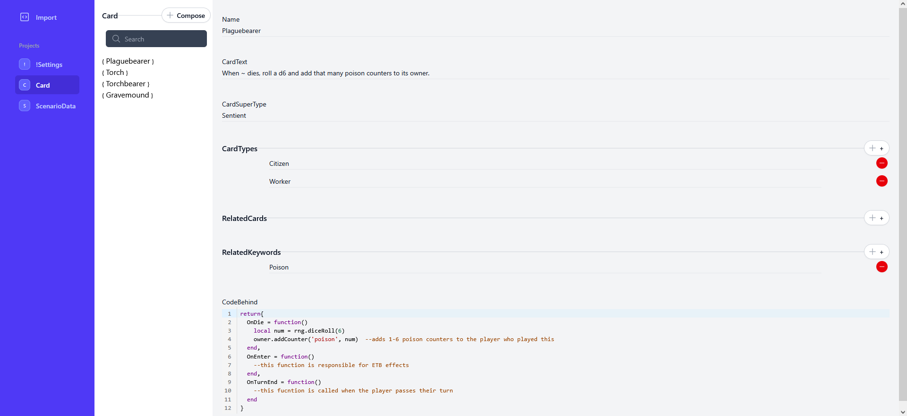

# RelationalSerializer

## Example



The above is generated from the following code:

```csharp
//...using statements
public class Card
{
    public string Name { get; set; }
    public string CardText { get; set; }
    public string CardSuperType { get; set; }
    public string[] CardTypes { get; set; }
    public Card[] RelatedCards { get; set; }
    public string[] RelatedKeywords { get; set; }
    public string CodeBehind { get; set; }

//...functions
}
```